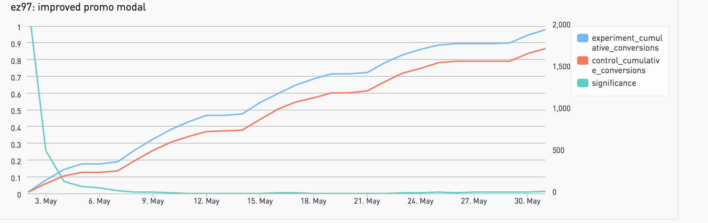
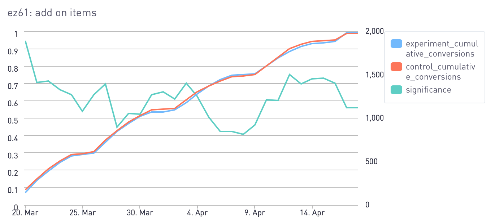

I have continued from part 1 where I provide more weekly thoughts. We are part way through the experiment at this point.

<!--truncate-->

## A single way that can state the success status of our test

I’ve seen various dashboards, pdfs, tables, graphs posted to show the early results of the test, demonstrating how well it is performing. But if our senior managers asked me the question “Is the test a success or failure?” and “What is your confidence that the test is a success or failure?” I would struggle to be able to answer these questions.

Is it possible to have one headline graph which represents success or failure of the ab test?

Having something like the following as a single point to explain how a test is performing can answer that question. X axis is time since the experiment started, left Y is the p value (0-1), right Y is the metric we are tracking. Blue and red lines show the variant performance.

The graphs are just examples, but we are looking for the green line to have a steady march down to 0 to know our test is a success. It should be quite clear to anyone that in this example the experiment variant has won and the experiment can be stopped as a success.

If we have a graph like the below we know that our experiment isn’t showing anything interesting and both variants are almost the same. We would either need to change the experiment or stop it as a failure.

## How should outliers be handled

Let’s imagine the following scenario

- Control Group
    - Seen by ten customers
    - Two customers make a booking, both booking three items. 
    - Six items were booked.
    - 20% of customers made a booking.

- Variant A
    - Seen by ten customers
    - One customer make a booking, but they book 1,000 items. 
    - 1,000 items were booked.
    - 10% of customers made a booking.

Which group wins? Does Variant A win as it has 1,000 bookings?

I was reading about how an open source tool called https://www.growthbook.io/ handles this, they have a description written about using capped values - https://docs.growthbook.io/app/metrics#capped-value.

## Bonus story

I have remembered a story from a few years ago when doing some AB testing, this is just a small anecdote. Our company had two channels to sell our product. 

- Self-service on the website
- Call centre with sales agents

We ran an experiment where we were trying to improve the conversion rate for the call centre. We implemented some changes to how queuing worked and altered who the agents spoke with and in which order. After a few weeks saw a huge jump in the conversion rate, something like 10%. The call centre staff were really excited, the number of sales they made reflected their end of year performance review.

After a bit more digging, we realised that for the same groups of customer the conversion rate on the self-service portal dropped. It made me reflect that making changes can have both positive and negative implications in ways you cannot anticipate. 

You must choose the metric that determines "success" carefully.