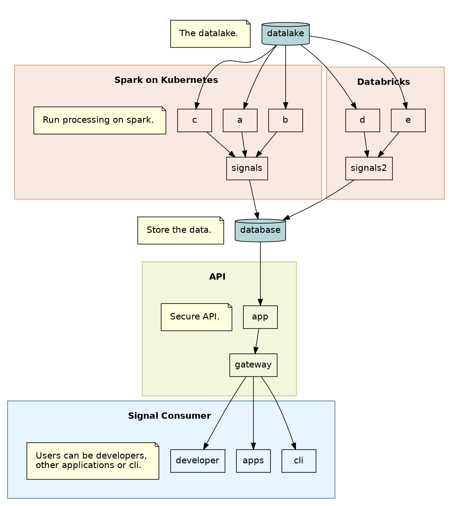

import useBaseUrl from '@docusaurus/useBaseUrl';

## Introduction

Graphviz allows diagrams to be generated automatically and allow versions to be diffed which is not possible with traditional diagram tools.

The diagrams can be compiled into multiple format types.

## Compiling

```bash
cat ./example.dot | dot -Tpng > ./dot-example.png
cat ./example.dot | dot -Tsvg > ./dot-example.svg
```

## Example



